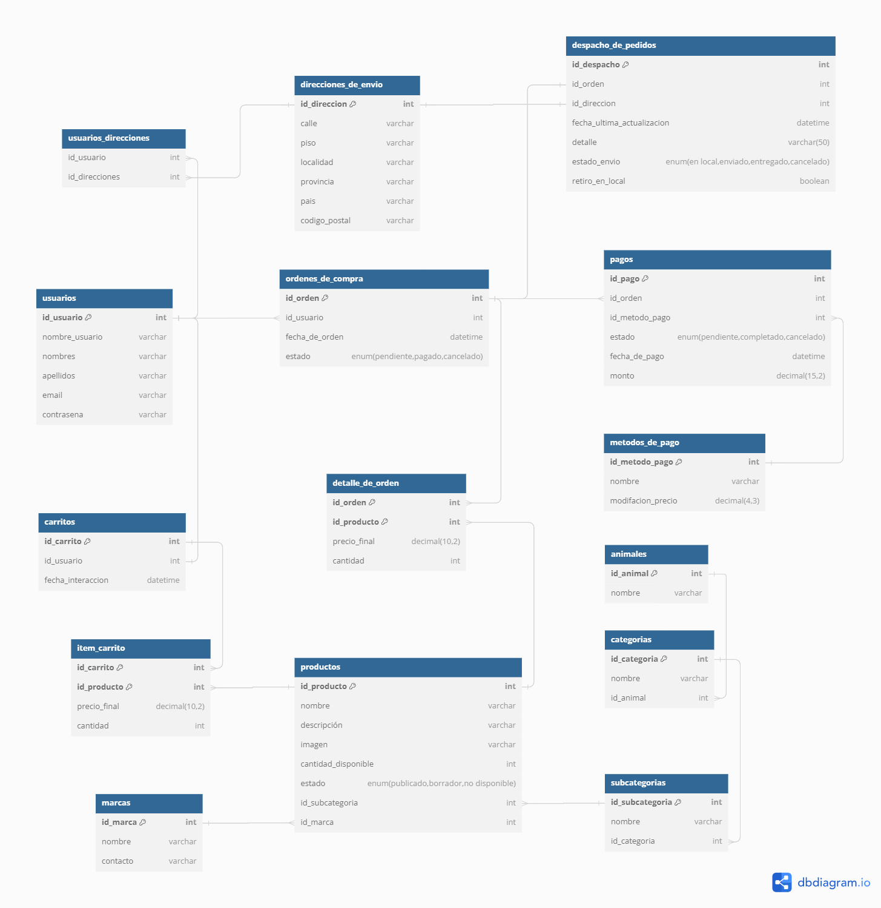

# Proyecto-SQL Petshop

### Descripción

Esta es una base de datos diseñada para la gestión de un e-commerce con la tematica de articulos para mascotas. En este e-commerce, los productos tienen multiples niveles de categorias y varias formas de realizar una busqueda (Por animal, marca, categoria y subcategoria). En este e-commerce, cada usuario debe ser capaz de añadir productos disponibles a su carrito de compra y con él realizar una orden de compra valida.

### Requerimientos a cumplir

1. Gestion de usuarios: Debe almacenar la información de los usuarios, contemplando la posibilidad de que estos tengan asignados más de una dirección de residencia posible para realizar un envio.
2. Gestion de productos: Cada producto registrado debe estar categorizado tanto por el tipo de animal al que este destinado como por sus caracteristicas (Ejemplo: en un tienda puede haber alimentos para perros como para peces. Mientras que los alimentos para perros pueden categorizarse por edad, los alimentos para peces pueden categorizarse dependiendo de si son de agua fria o tropicales). Asimismo, cada registro debe contener información relevante para su publicación y su busqueda dentro del ecommerce.
3. Gestion de Carrito de compra: Cada usuario debe estar relacionado a un carrito de compra con el cual podrá gestionar la compra de varios productos, siempre y cuando estos esten disponibles.
4. Gestion de Compras: Se debe llevar un registro de las compras efectuadas, teniendo los productos que la componen, incluyendo sus respectivas cantidades, el usuario que la efectua, la fecha y hora en la que se realize y el metodo de pago utilizado.
5. Gestion de Pagos y Despacho de Compra: Cada orden de compra deberá estar asociada a un pago y a una forma de despachar el pedido, ya sea por retiro en el local o por envio.

---

## Importante para correr la base de datos

Para multiples actualizaciones y eliminaciones, ejecutar la siguiente linea:

```sql
SET SQL_SAFE_UPDATE=FALSE;
```
En mi version de MYSQL WORKBENCH 8.0 generó un error y tuve que cambiarlo de la siguiente forma
-> Edit -> Preferences -> SQL Editor -> Destildar la opcion 'Safe updates'


Para correr de forma automatica por consola, cambiar los valores del archivo .env

```
MYSQL_ROOT_PASSWORD=root
MYSQL_USER=root
```
A continuación, ejecutar el comando

```bash
make
```

**Nota**

Para la inserción de datos, algunos fueron importado por archivos csv. creados en windows. En caso de erros, completar las rutas en el archivo population.sql

```sql
LOAD DATA LOCAL INFILE   '/sql_project/data_csv/subcategorias.csv'
```

---

### Tablas

1. **USUARIOS**
  - Almacena los datos de cada usuario registrado en el ecommerce
  - Atributos: id_usuario, nombre_de_usuario, nombres, apellidos,email, contresena
 
2. **DIRECCIONES**
  - Cada usuario tiene la posibilidad de tener más una dirección y, en ciertos casos, más de un usuario puede tener la misma dirección. Por lo tanto se utiliza una tabla de direcciones relacionadas a usuarios
  - Atributos: id_direccion, calle, piso, localidad, provincia, pais, codigo_postal

3. **USUARIOS_DIRECCIONES**
- Debido a que mas de un usuario puede compartir la mismo domicilio con otra persona y al mismo tiempo tener más de un domicilio valido para realizar un envio, estable una relación n a n
- Atributos: id_usuario, id_direccion
   
4. **CARRITOS**
  - Tabla de Carrito de compra. Cada uno esta asignado a un unico usuario. Pasado cierto tiempo, un carrito de compra que no haya efecutado una compra debería vaciarse, por lo tanto se almacena la fecha de creación para poder verificarla. Es posible calcular el precio total de un carrito por medio de una funcion.

  - Atributos: id_carrito, id_usuario, fecha_creacion

5. **ITEM_CARRITO**
  - Tabla intermedia para la relación de carritos con los productos que se ha seleccionado el usuario y la cantidad de los mismos. 
  - Atributos: id_carrito, id_producto, cantidad

6. **ORDENES_DE_COMPRA**
  - Tabla para hechos que registra en que momento se realiza transaccion de compra, el usuario la efectua y en que estado se encuentran las transacciones.
  - Atributos: id_orden, id_usuario, fecha_de_orden, estado
  
7. **DETALLE_DE_ORDEN**
  - Tabla de union para la relacion n-n entre las ordenes de compra y los productos. Debido a que es posible que el precio oficial de un producto cambié, se agregó un campo extra de precio en esta tabla para que este precio sea independiente a la tabla Productos.
  - Atributos: id_orden, id_producto, id_cantida, precio_final

8. **METODOS_DE_PAGO**
  - Tabla para registrar los metodos de pago disponibles. Dependiendo del metodo de pago, el precio final de una orden de compra puede verse afectado, por lo que añadió un columna que registra la razón de cambio de precio.
  - Atributos: id_metodo_pago, nombre, modificación_precio

9. **PRODUCTOS**
  - Registro de los productos disponible. Cada producto cuenta con sus respectivo precio, descripción, imagen de publicación, cantidad en stock y un dato que indica en que estado se encuentra (publicado, en borrador o no disponible). Los productos deben poder filtrarse dentro de la pagina, tanto por la marca como por su categoria.
  - Atributos: id_producto, nombre, descripción, imagen, cantidad_disponible, estado, id_subcategoria, id_marca

10. **MARCAS**
  - Tabla que almacena las marcas disponibles con las se trabaja
  - Atributos: id_marca, nombre

11. **SUBCATEGORIAS**
  - Ultimo nivel  de categorias para los productos. Cada subcategoria debe estar relacionada a la categoria que le corresponde(Ejemplo: La categoria de Salud puede relacionarse con las subcategorias Antiparacitarios y Medicamentos)
  - Atributos: id_subcategoria, nombre, id_categoria

12. **CATEGORIAS**
  - Tabla de categorias para los productos, relacionado a la especie animal para la cual esta dirigido.
  - Atributos: id_categoria, nombre, id_animal
  
13. **ANIMALES**
  - Tabla que almacena los tipos de animales para los cuales se van a vender los productos
  - Atributos: id_animales, nombre

14. **PAGOS**
  - Tabla de transaccion de los pagos de cada orden de compra. Para mantener una logica simple, se configuró para que cada orden de compra tenga solo un pago asociado, por lo que se se creó una relación 1 - 1 con las tabla ORDENES_DE_COMPRA y METODOS_DE_PAGO. 
  - Atributos: id_pago, id_orden, id_metodo_pago, estado, fecha_de_pago, monto

15. **DESPACHO DE PRODUCTOS**
  - Tabla de transaccion para la entrega de pedidos con una relacion 1 a 1 con la tabla ORDENES_DE_COMPRA. Para que las consultas SQL no sean tan complejas a la hora de pedir información, se agruparon en la misma tablas los pedidos que se retiran en el local y los que se envian. Se resolvió que aquellos pedidos para envio se relacionen con la tabla DIRECCIONES_DE_ENVIO por medio del campo id_direccion, la cual a su vez deberá validarse respecto al usuario que haya realizado la compra (es decir, la dirección de envio deberá estar relacionada al usuario que haya efectuado la orden de compra). En el caso de que el pedido sea para retirar de forma presencial, el campo deberá quedar Nulo. En caso de haber algun problema con el retiro del pedido, este puede expresarse en el campo 'detalle'.
  - Atributos: id_despacho, id_orden, id_direccion, fecha_ultima_actualizacion, detalle, estado_envio, retiro_en_local



---
### Insercion
Los datos para cada tabla se obtienen al correr el archivo  'population.sql' por medio de multiples INSERT INTO

```sql
LOAD DATA LOCAL INFILE   '/sql_project/data_csv/subcategorias.csv'
    INTO TABLE petshop_ecommerce.SUBCATEGORIAS
    FIELDS TERMINATED BY ',' ENCLOSED BY '"'
    LINES TERMINATED BY '\r\n'
    IGNORE 1 LINES
    (nombre,id_categoria);
```

**NOTAS:**
Si el proyecto se corre de manera local, requerirá colocar la ruta completa de los archivos. Los archivos csv fueron creados en windows; en el caso de que cuente con archivos creados en linux, se debe modificar la siguiente linea:

```sql
LINES TERMINATED BY '\n'
```
Para las demas tablas, se insertaron datos mediante el comando DML INSERT INTO.

---

## Funciones

### Función check_usuario_direccion

**Descripción:** Recibe como parametros el id de un usuario y el id de una direccion para corroborar que esten relacionados en la tabla USUARIO_DIRECCION.

**Parámetros:**
* **p_id_usuario**: Identificador unico de cada usuario
* **p_id_direccion**: Identificador unico de cada dirección de envio almacenada

**Retorno**
* BOOLEAN: True si la dirección y el usuario estan relacionados. En caso contrario, retorna FALSE

### Función mostrar_precio

**Descripción:** Recibe un valor de precio y lo devuelve en formato VARCHAR, anteponiendo el caracter '$'

**Parámetros:**
* **var_precio**: Precio de un producto, carrito u orden de compra 

**Retorno**
* VARCHAR: Precio visualizado con el caracter '$' al inicio

### Función calcular_precio_final

**Descripción:** Dado un monto de precio y un id de metodo de pago, se valida que el metodo de pago exista en la base de datos y luego, en base a su modificador y al precio original, calcula el precio final. En caso de que el id del método de pago no exista, se lanza un SIGNAl.

**Parámetros:**
* **var_precio**: Precio de un producto, carrito u orden de compra 
* **id_metodo_pago**: Identificador unico de métodos de pago.

**Retorno**
* DECIMAL: Precio calculado en función del modificador de precio

### Función id_ultima_orden_de_compra_de_usuario:

**Descripción:** Esta función retorna el id de la ultima compra que haya realizado un usuario. En vista de que una orden de compra puede presentar error al insertar datos (por ejemplo, insertar una cantidad o precio erroneo), se considera de utilidad tener disposicion una función que acceda a la ultima compra de un usuario para realizar correcciones.

**Parámetros:**
* **var_id_usuario** : Identificador único de cada usuario.

**Retorno:**
* INT: Identificador único de la ultima orden de compra realizada por un usuario.

### Funcion calcular_precio_total_de_orden:

**Descripción:** Esta función retorna el precio total de una determinada orden de compra. Calcular este valor es de gran utlidad a la hora de mostrar los datos de una o más ordenes de compra

**Parámetros:**
* **var_id_orden** : Identificador único de cada orden de compra.

**Retorno:**
* Decimal: Monto total de la orden de compra

### Funcion calcular_precio_total_de_carrito:

**Descripción:** Esta función retorna el precio total de una determinada orden de carrito. Calcular este valor es de gran utlidad a la hora de mostrar los datos de un carrito de compra relacionado a un usuario

**Parámetros:**
* **var_id_carrito** : Identificador único de cada carrito de compra.

**Retorno:**
* Decimal: Monto total del carrito de compra

---

## Vistas

Se consideró de utilidad tener a disponición las siguientes vista:

### 1. PRECIO_TOTAL_DE_CARRITOS:

Almacena una query que permite visualizar el precio de cada carrito de compra activo con el fin de tener a consideración las posibles ventas que se vayan a realizar

**Columnas:**
* id_usuario: Identificador único del usuario
* nombre_de_usuario: Nombre único con el que se puede identificar a un usuario
* total_a_pagar: Función creada previamente para calcular y mostrar el monto total acumulado de los items de cada carrito.

### 2. TOTAL_A_PAGAR_POR_ORDEN_DE_COMPRA:

Almacena una query que permite visualizar el precio de cada orden de compras, junto con sus datos correspondientes.


**Columnas:**
* id_orden: Identificador único de la orden de compra
* id_usuario: Identificador único del usuario que efectuó la compra
* estado: Estado en el que se encuentra la compra. Puede adquirir los valores 'pendiente','pagado','cancelado'
* fecha_de_orden: Fecha y hora en la que efectuó la compra
* monto_estandar: Implementa la función calcular_precio_total_de_orden para mostrar el monto, sin tener en cuenta el metodo pago
  
### 3. VISTA_PRODUCTOS_POR_TOTAL_VENDIDOS: 

Permite ver la cantidad de Producto que se han vendido historicamente

**Columnas:**
* id_producto: Identificador único de cada producto
* nombre: Nombre de los productos que han sido comprados
* total_vendido: Cantidad de productos que han sido comprados
  
### 4. HISTORIAL_VENTA_DE_PRODUCTOS_POR_MONTO_FINAL

Visualiza historicamente a que precio ha sido vendido cada producto. Debido a que el campo precio de la tabla PRODUCTO es meramente de referencia para no afectar a la tabla DETALLE_DE_ORDEN, es de utlidad revisar a que precios se han vendido los productos.

**Columnas:**
* id_orden: Identificador unico de cada orden de compra
* fecha_de_orden: Fecha en la que se vendio uno o más productos
* id_producto: Identificador unico de cada producto
* nombre_de_producto: Nombre de referencia de un producto
* precio_de_venta: Precio al que se vendio un producto en una fecha y hora determinada
* cantidad: Cantidad de un producto vendido en una fecha y hora determinada
  

### 5. VISUALIZACION_DE_SUBCATEGORIAS

Permite visualizar de cada subcategoria almacena con su correspondiente categoria y el animal relacionado

**Columnas:**
* id_subcategoria: Identificador único de cada subcategoría
* Subcategoria: Nombre de la subcategoría selecionada
* Categoria: Nombre de la categoria principal a la que de pertence la subcategoría
* Animal: Nombre del tipo de animal al que pertence la categoría

### 6. USUARIOS_SIN_COMPRAS_HACE_3_MESES

Vista de los usuarios que no han comprado hace 3 meses

**Columnas:**
* id_usuario: Identificador único de cada usuarios.
* nombre_de_usuario: Nombre único con el que se identifica a cada usuarios.
* email: Email único relacionado con el usuario.


---

## STORED PROCEDURES

### 1. revision_carritos():
  Mediante este procedimiento se buscar automatizar el limpiado de aquellos carritos de compra que llevan inactivos por más de 2 dos días. Si bien esta implementado como un STORED PROCEDURE, podría implementarse tambien como un EVENTO. Al no tomar ningún valor como parámetro, no es necesario incluir validaciones.

```sql
DELETE FROM ITEM_CARRITO
    WHERE id_carrito IN
		(SELECT c.id_carrito FROM CARRITOS as C
    WHERE c.fecha_interaccion<= date_sub(now(), INTERVAL 2 DAY)); 
```

Al terminar la ejecución, recorré la tabla CARRITOS y actualiza a la fecha y hora del momento aquellos los valores de fecha_interaccion cuyo intervalo de tiempo sea mayor a 2 días. En decir, aquello carritos de compra que fueron vaciados

### 2. realizar_compra(IN var_id_carrito INT, IN var_id_metodo_pago INT, IN var_id_direccion INT)
   
   Por medio de este procedimiento, una vez que sa validen los datos ingresados, se genera una nueva orden de compra correspondiendo al usuario dueño del carrito. A continuación, los datos de cada producto relacionado al carrito, pasan a ser relacionado a la orden de compra generada ingresandolos en la tabla DETALLE_ORDEN, con el dato de precio que se recuepera en la tabla PRODUCTOS y la cantidad registrada en ITEM_CARRITO. Luego de esto, se crean 2 registros relacionados a la nueva orden de compra: Uno para el pago correspondiente y otro para el despacho de pedido. Para este último, se debe considerar los siguientes punto:

   - 1. Si el dato de direccion es nulo, se genera una registro de forma que este indique que el pedido será retirado en el local
   - 2. Si el dato es no nulo, se debe verificar que la direccion este relacionada con el usuario. Si hay relación, se crea un registro indicando que el pedido va a ser enviado al domicilio.
   
   Cabe aclarar que el stock de cada producto se descuenta mediante un Trigger, los cuales lanzan un SIGNAL al intentar descontar una cantidad mayor a la disponible. Debido a las validaciones y errores que pueden suceder durante las transacciones, se utiliza TCL para realizar un COMMIT el terminar el procedimiento sin errores. En caso de que se lanze una excepción durante la ejecución, todos los movimientos se anulan.
   
   Al terminar la ejecución, se vacian los items de la tabla ITEM_CARRITO relacionados al id que se pasó por parámetro.
  
---

## Triggers
1. validar_productos_al_insertar()
2. validar_producto_al_actualizar
3. crear_carrito_para_usuario
   

### Ideas para integrar al proyecto:
1. Llevar a cabo un registro de proveedores, de acuerdo a la marca de los productos
2. Gestionar los envios de acuerdo a la orden de compra y la dirección ingresada por el usuario
3. Revisar el estado de los pagos, en el caso de integrar compras con cuotas
4. Gestionar devoluciones y anulaciones de compra
5. Detallar el tipo de Facturación. En el caso de Factura A se debe incluir la entidad y el cuil
