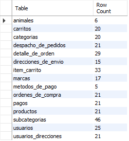
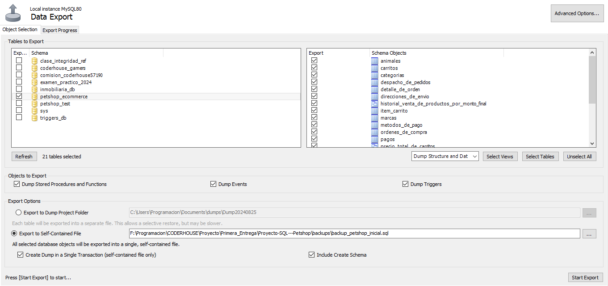
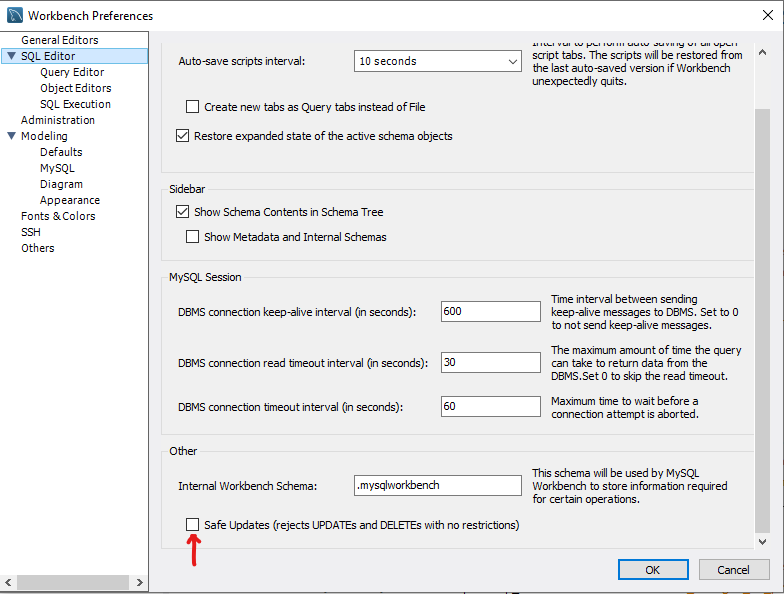

# Proyecto SQL - Coderhouse

Alumno: Nahuel Fernando Ahumada

Comision: 57190

Tutor: Ariel Annone

Profesor: Anderson Michel Torres

---

### Introducción

Esta es una base de datos diseñada en MYSQL para la gestión de un e-commerce con la temática de árticulos para mascotas. Este contiene productos con múltiples niveles de categorías y varias formas de realizar una busqueda (Por animal, marca, categoría y subcategoría). En la base de datos, cada usuario registrado tendrá asociado un carrito de compras, con el cual podrá añadir productos disponibles y generar una orden de compra valida, pudiendo definir el método de pago y si desea recibirlo por envío o retirarlo al local.

---

### Objetivo

Diseñar e implementar una base de datos relacional que permita gestionar de manera eficiente las operaciones de un e-commerce, asegurando que la gestión de usuarios, las ordenes de compra y la entrega de productos estén bien documentados y organizados. Al mismo tiempo, debe ser capaz de desplegar información de múltiples tablas de manera eficiente para distintos roles del proyecto.

---

### Situación problemática

Se necesita un base de datos con una estructura bien definida, que permita adaptarse facilmente a nuevos requerimientos y se asegure la consistencia de los datos a través de reglas de integridad referencial y permisos de usuario bien definidos.

### Requerimientos a cumplir

1. Gestion de usuarios: Debe almacenar la información de los usuarios, contemplando la posibilidad de que estos tengan asignados más de una dirección de residencia posible para realizar un envio.
2. Gestion de productos: Cada producto registrado debe estar categorizado tanto por el tipo de animal al que este destinado como por sus caracteristicas (Ejemplo: en un tienda puede haber alimentos para perros como para peces. Mientras que los alimentos para perros pueden categorizarse por edad, los alimentos para peces pueden categorizarse dependiendo de si son de agua fria o tropicales). Asimismo, cada registro debe contener información relevante para su publicación y su busqueda dentro del ecommerce.
3. Gestion de Carrito de compra: Cada usuario debe estar relacionado a un carrito de compra con el cual podrá gestionar la compra de varios productos, siempre y cuando estos esten disponibles.
4. Gestion de Compras: Se debe llevar un registro de las compras efectuadas, teniendo los productos que la componen, incluyendo sus respectivas cantidades, el usuario que la efectua, la fecha y hora en la que se realize y el metodo de pago utilizado.
5. Gestion de Venta: Cada orden de compra deberá estar asociada a un pago y a una forma de despachar el pedido, ya sea por retiro en el local o por envio.

---

## Tablas

### Diagrama entidad - relación


### Listado de tablas

| Tabla                 | Columna           | Tipo de Datos                         |
| ----------------------|-------------------|                                  ---: |
| USUARIOS              | ID_USUARIO        | INT (PK)                              |
|                       | NOMBRE_DE_USUARIO | VARCHAR(60) NOT NULL UNIQUE           |
|                       | NOMBRES           | VARCHAR(80) NOT NULL                  |
|                       | APELLIDOS         | VARCHAR(80) NOT NULL                  |
|                       | EMAIL             | VARCHAR(100) NOT NULL                 |
|                       | CONTRASENA        | VARCHAR(60) NOT NULL                  |

| Tabla                 | Columna           | Tipo de Datos                         |
| ----------------------|-------------------|                                  ---: |
| DIRECCIONES_DE_ENVIO  | ID_DIRECCION      | INT (PK)                              |
|                       | CALLE             | VARCHAR(60) NOT NULL                  |
|                       | PISO              | VARCHAR(10)                           | 
|                       | LOCALIDAD         | VARCHAR(60) NOT NULL                  |
|                       | PROVINCIA         | VARCHAR(60) NOT NULL                  |
|                       | PAIS              | VARCHAR(60) NOT NULL                  |
|                       | CODIGO_POSTAL     | VARCHAR(20) NOT NULL                  |

| Tabla                 | Columna           | Tipo de Datos                         |
| ----------------------|-------------------|                                  ---: |
| USUARIOS_DIRECCIONES  | ID_USUARIO        | INT (PK)(FK)                          |
|                       | ID_DIRECCION      | INT (PK)(FK)                          |

| Tabla                 | Columna           | Tipo de Datos                         |
| ----------------------|-------------------|                                  ---: |
| CARRITOS              | ID_CARRITO        | INT (PK)                              |
|                       | ID_USUARIO        | INT (FK) UNIQUE NOT NULL              |
|                       | FECHA_INTERACCION | DATETIME NOT NULL DEFAULT NOW()       |

| Tabla                 | Columna           | Tipo de Datos                         |
| ----------------------|-------------------|                                  ---: |
| ITEM_CARRITO          | ID_CARRITO        | INT (PK)(FK)                          |
|                       | ID_PRODUCTO       | INT (PK)(FK)                          |
|                       | CANTIDAD          | INT                                   |

| Tabla                 | Columna             | Tipo de Datos                                                  |
| ----------------------|---------------------|                                                           ---: |
| PRODUCTOS             | ID_PRODUCTO         | INT (PK)                                                       |
|                       | NOMBRE              | VARCHAR(100) NOT NULL                                          |
|                       | DESCRIPCION         | VARCHAR(350) NOT NULL                                          |
|                       | PRECIO              | DECIMAL (10,2)                                                 |
|                       | IMAGEN              | VARCHAR(100)                                                   |
|                       | CANTIDAD_DISPONIBLE | INT DEFAULT 1                                                  |
|                       | ESTADO              | ENUM('publicado','borrador','no disponible') DEFAULT 'borrador'|
|                       | ID_SUBCATEGORIA     | INT (FK) NOT NULL                                              |
|                       | ID_MARCA            | INT (FK) NOT NULL                                              |

| Tabla                 | Columna           | Tipo de Datos                         |
| ----------------------|-------------------|                                  ---: |
| MARCAS                | ID_MARCA          | INT (PK)                              |
|                       | NOMBRE            | VARCHAR(60) NOT NULL                  |
|                       | CONTACTO          | VARCHAR(60)                           |

| Tabla                 | Columna           | Tipo de Datos                         |
| ----------------------|-------------------|                                  ---: |
| SUBCATEGORIAS         | ID_SUBCATEGORIA   | INT (PK)                              |
|                       | NOMBRE            | VARCHAR(60) NOT NULL                  |
|                       | ID_CATEGORIA      | INT (FK) NOT NULL                     |

| Tabla                 | Columna           | Tipo de Datos                         |
| ----------------------|-------------------|                                  ---: |
| CATEGORIAS            | ID_CATEGORIA      | INT (PK)                              |
|                       | NOMBRE            | VARCHAR(60) NOT NULL                  |
|                       | ID_ANIMAL         | INT (FK) NOT NULL                     |

| Tabla                 | Columna           | Tipo de Datos                         |
| ----------------------|-------------------|                                  ---: |
| ANIMALES              | ID_ANIMAL         | INT (PK)                              |
|                       | NOMBRE            | VARCHAR(60) NOT NULL                  |

| Tabla                 | Columna           | Tipo de Datos                                                |
| ----------------------|-------------------|                                                         ---: |
| ORDENES_DE_COMPRA     | ID_ORDEN          | INT (PK)                                                     |
|                       | ID_USUARIO        | INT (FK) NOT NULL                                            |
|                       | ESTADO            | ENUM('pendiente','efecutada','cancelada') DEFAULT 'pendiente'|
|                       | FECHA_DE_ORDEN    | DATETIME NOT NULL DEFAULT NOW()                              |

| Tabla                 | Columna           | Tipo de Datos                         |
| ----------------------|-------------------|                                  ---: |
| DETALLE_DE_ORDEN      | ID_ORDEN          | INT (PK)(FK)                          |
|                       | ID_PRODUCTO       | INT (PK)(FK)                          |
|                       | PRECIO_FINAL      | DECIMAL (10,2)                        |
|                       | CANTIDAD          | INT NOT NULL                          |

| Tabla                 | Columna             | Tipo de Datos                         |
| ----------------------|---------------------|                                  ---: |
| METODOS_DE_PAGOS      | ID_METODO_PAGO      | INT (PK)                              |
|                       | NOMBRE              | VARCHAR(35)                           |
|                       | MODIFICACION_PRECIO | DECIMAL (4,3)                         |

| Tabla                 | Columna           | Tipo de Datos                                                 |
| ----------------------|-------------------|                                                          ---: |
| PAGOS                 | ID_PAGO           | INT (PK)                                                      |
|                       | ID_ORDEN          | INT (FK) NOT NULL UNIQUE                                      |
|                       | ID_METODO_PAGO    | INT (FK) NOT NULL                                             |
|                       | ESTADO            | ENUM('pendiente','completado','cancelado') DEFAULT 'pendiente'|
|                       | FECHA_PAGO        | DATETIME NOT NULL DEFAULT NOW()                               |
|                       | MONTO             | DECIMAL (15,2) NOT NULL DEFAULT 0                             |

| Tabla                 | Columna               | Tipo de Datos                                                        |
| ----------------------|-----------------------|                                                                 ---: |
| DESPACHO_DE_PEDIDOS   | ID_DESPACHO           | INT (PK)                                                             |
|                       | ID_ORDEN              | INT (FK) NOT NULL UNIQUE                                             |
|                       | ID_DIRECCIO           | INT (FK)                                                             |
|                       | ULTIMA_INTERACCION    | DATETIME NOT NULL DEFAULT NOW()                                      |
|                       | DETALLE               | VARCHAR (50)                                                         |
|                       | ESTADO_ENVIO          | ENUM('en local','enviado','entregado','cancelado') DEFAULT 'en local'|
|                       | RETIRO_EN_LOCAL       | BOOLEAN DEFAULT FALSE                                                |


1. **USUARIOS**
  - Almacena los datos de cada usuario registrado en el ecommerce
  - Atributos: id_usuario, nombre_de_usuario, nombres, apellidos,email, contresena
 
2. **DIRECCIONES_DE_ENVIO**
  - Cada usuario tiene la posibilidad de tener más una dirección y, en ciertos casos, más de un usuario puede tener la misma dirección. Por lo tanto se utiliza una tabla de direcciones relacionadas a usuarios
  - Atributos: id_direccion, calle, piso, localidad, provincia, pais, codigo_postal

3. **USUARIOS_DIRECCIONES**
- Debido a que mas de un usuario puede compartir la mismo domicilio con otra persona y al mismo tiempo tener más de un domicilio valido para realizar un envio, estable una relación n a n
- Atributos: id_usuario, id_direccion
   
4. **CARRITOS**
  - Tabla de Carrito de compra. Cada uno esta asignado a un unico usuario. Pasado cierto tiempo, un carrito de compra que no haya efecutado una compra debería vaciarse, por lo tanto se almacena la fecha de creación para poder verificarla. Es posible calcular el precio total de un carrito por medio de una funcion.

  - Atributos: id_carrito, id_usuario, fecha_creacion

5. **ITEM_CARRITO**
  - Tabla intermedia para la relación de carritos con los productos que se ha seleccionado el usuario y la cantidad de los mismos. 
  - Atributos: id_carrito, id_producto, cantidad

6. **ORDENES_DE_COMPRA**
  - Tabla para hechos que registra en que momento se realiza transaccion de compra, el usuario la efectua y en que estado se encuentran las transacciones.
  - Atributos: id_orden, id_usuario, fecha_de_orden, estado
  
7. **DETALLE_DE_ORDEN**
  - Tabla de union para la relacion n-n entre las ordenes de compra y los productos. Debido a que es posible que el precio oficial de un producto cambié, se agregó un campo extra de precio en esta tabla para que este precio sea independiente a la tabla Productos.
  - Atributos: id_orden, id_producto, id_cantida, precio_final

8. **METODOS_DE_PAGO**
  - Tabla para registrar los metodos de pago disponibles. Dependiendo del metodo de pago, el precio final de una orden de compra puede verse afectado, por lo que añadió un columna que registra la razón de cambio de precio.
  - Atributos: id_metodo_pago, nombre, modificación_precio

9. **PRODUCTOS**
  - Registro de los productos disponible. Cada producto cuenta con sus respectivo precio, descripción, imagen de publicación, cantidad en stock y un dato que indica en que estado se encuentra (publicado, en borrador o no disponible). Los productos deben poder filtrarse dentro de la pagina, tanto por la marca como por su categoria.
  - Atributos: id_producto, nombre, descripción, imagen, cantidad_disponible, estado, id_subcategoria, id_marca

10. **MARCAS**
  - Tabla que almacena las marcas disponibles con las se trabaja
  - Atributos: id_marca, nombre

11. **SUBCATEGORIAS**
  - Ultimo nivel  de categorias para los productos. Cada subcategoria debe estar relacionada a la categoria que le corresponde(Ejemplo: La categoria de Salud puede relacionarse con las subcategorias Antiparacitarios y Medicamentos)
  - Atributos: id_subcategoria, nombre, id_categoria

12. **CATEGORIAS**
  - Tabla de categorias para los productos, relacionado a la especie animal para la cual esta dirigido.
  - Atributos: id_categoria, nombre, id_animal
  
13. **ANIMALES**
  - Tabla que almacena los tipos de animales para los cuales se van a vender los productos
  - Atributos: id_animales, nombre

14. **PAGOS**
  - Tabla de transaccion de los pagos de cada orden de compra. Para mantener una logica simple, se configuró para que cada orden de compra tenga solo un pago asociado, por lo que se se creó una relación 1 - 1 con las tabla ORDENES_DE_COMPRA y METODOS_DE_PAGO. 
  - Atributos: id_pago, id_orden, id_metodo_pago, estado, fecha_de_pago, monto

15. **DESPACHO DE PRODUCTOS**
  - Tabla de transaccion para la entrega de pedidos con una relacion 1 a 1 con la tabla ORDENES_DE_COMPRA. Para que las consultas SQL no sean tan complejas a la hora de pedir información, se agruparon en la misma tablas los pedidos que se retiran en el local y los que se envian. Se resolvió que aquellos pedidos para envio se relacionen con la tabla DIRECCIONES_DE_ENVIO por medio del campo id_direccion, la cual a su vez deberá validarse respecto al usuario que haya realizado la compra (es decir, la dirección de envio deberá estar relacionada al usuario que haya efectuado la orden de compra). En el caso de que el pedido sea para retirar de forma presencial, el campo deberá quedar Nulo. En caso de haber algun problema con el retiro del pedido, este puede expresarse en el campo 'detalle'.
  - Atributos: id_despacho, id_orden, id_direccion, ultima_interaccion, detalle, estado_envio, retiro_en_local


---

### Inserción de datos

Para las tablas `DIRECCIONES_DE_ENVIO`, `USUARIOS`, `SUBCATEGORIAS` y `PRODUCTOS` se importan los datos mediante los correspondientes archivos .csv. El resto de datos de prueba se insertan  mediante el comando DML INSERT INTO.

**Importación**

Es importante configurar los permisos pertinentes en MySQL con la siguiente linea de código: 

```sql
SET GLOBAL local_infile=1;
```
(Esta linea se insertó el archivo `population.sql`) 

Luego de esa configuración, ya es posible ejecutar el siguiente comando para la importación:

```sql
LOAD DATA LOCAL INFILE   '/sql_project/data_csv/nombre_de_archivo.csv'
    INTO TABLE petshop_ecommerce.NOMBRE_DE_TABLA
    FIELDS TERMINATED BY ',' ENCLOSED BY '"'
    LINES TERMINATED BY '\n'
    IGNORE 1 LINES
    (COLUMNAS);
```

Si el proyecto se corre de manera local, requerirá colocar la ruta completa de los archivos en la primera linea.

```sql
LOAD DATA LOCAL INFILE   '/sql_project/data_csv/nombre_de_archivo.csv'
```
En el caso de error, dependiendo de su sistema operativos deberá cambiar la siguiente linea

```sql
LINES TERMINATED BY '\r\n'
```
Al terminar la inserción, los registro deben quedar de la siguiente forma:



Esto se puede corroborar desde 'check_db_objects.sql' o

```bash
make test-db
```


---

## Funciones

### Función check_usuario_direccion

**Descripción:** Recibe como parametros el id de un usuario y el id de una direccion para corroborar que esten relacionados en la tabla USUARIO_DIRECCION.

**Parámetros:**
* **p_id_usuario**: Identificador unico de cada usuario
* **p_id_direccion**: Identificador unico de cada dirección de envio almacenada

**Retorno**
* BOOLEAN: True si la dirección y el usuario estan relacionados. En caso contrario, retorna FALSE

### Función mostrar_precio

**Descripción:** Recibe un valor de precio y lo devuelve en formato VARCHAR, anteponiendo el caracter '$'

**Parámetros:**
* **var_precio**: Precio de un producto, carrito u orden de compra 

**Retorno**
* VARCHAR: Precio visualizado con el caracter '$' al inicio

### Función calcular_precio_final

**Descripción:** Dado un monto de precio y un id de metodo de pago, se valida que el metodo de pago exista en la base de datos y luego, en base a su modificador y al precio original, calcula el precio final. En caso de que el id del método de pago no exista, se lanza un SIGNAl.

**Parámetros:**
* **var_precio**: Precio de un producto, carrito u orden de compra 
* **id_metodo_pago**: Identificador unico de métodos de pago.

**Retorno**
* DECIMAL: Precio calculado en función del modificador de precio

### Función id_ultima_orden_de_compra_de_usuario:

**Descripción:** Esta función retorna el id de la ultima compra que haya realizado un usuario. En vista de que una orden de compra puede presentar error al insertar datos (por ejemplo, insertar una cantidad o precio erroneo), se considera de utilidad tener disposicion una función que acceda a la ultima compra de un usuario para realizar correcciones.

**Parámetros:**
* **var_id_usuario** : Identificador único de cada usuario.

**Retorno:**
* INT: Identificador único de la ultima orden de compra realizada por un usuario.

### Funcion calcular_precio_total_de_orden:

**Descripción:** Esta función retorna el precio total de una determinada orden de compra. Calcular este valor es de gran utlidad a la hora de mostrar los datos de una o más ordenes de compra

**Parámetros:**
* **var_id_orden** : Identificador único de cada orden de compra.

**Retorno:**
* Decimal: Monto total de la orden de compra

### Funcion calcular_precio_total_de_carrito:

**Descripción:** Esta función retorna el precio total de una determinada orden de carrito. Calcular este valor es de gran utlidad a la hora de mostrar los datos de un carrito de compra relacionado a un usuario

**Parámetros:**
* **var_id_carrito** : Identificador único de cada carrito de compra.

**Retorno:**
* Decimal: Monto total del carrito de compra

---

## Vistas

Se consideró de utilidad tener a disponición las siguientes vista:

### 1. PRECIO_TOTAL_DE_CARRITOS:

Almacena una query que permite visualizar el precio de cada carrito de compra activo con el fin de tener a consideración las posibles ventas que se vayan a realizar

**Columnas:**
* id_usuario: Identificador único del usuario
* nombre_de_usuario: Nombre único con el que se puede identificar a un usuario
* total_a_pagar: Función creada previamente para calcular y mostrar el monto total acumulado de los items de cada carrito.

### 2. TOTAL_A_PAGAR_POR_ORDEN_DE_COMPRA:

Almacena una query que permite visualizar el precio de cada orden de compras, junto con sus datos correspondientes.


**Columnas:**
* id_orden: Identificador único de la orden de compra
* id_usuario: Identificador único del usuario que efectuó la compra
* estado: Estado en el que se encuentra la compra. Puede adquirir los valores 'pendiente','efectuada','cancelado'
* fecha_de_orden: Fecha y hora en la que efectuó la compra
* monto_estandar: Implementa la función calcular_precio_total_de_orden para mostrar el monto, sin tener en cuenta el metodo pago
  
### 3. VISTA_PRODUCTOS_POR_TOTAL_VENDIDOS: 

Permite ver la cantidad de Producto que se han vendido historicamente

**Columnas:**
* id_producto: Identificador único de cada producto
* nombre: Nombre de los productos que han sido comprados
* total_vendido: Cantidad de productos que han sido comprados
  
### 4. HISTORIAL_VENTA_DE_PRODUCTOS_POR_MONTO_FINAL

Visualiza historicamente a que precio ha sido vendido cada producto. Debido a que el campo precio de la tabla PRODUCTO es meramente de referencia para no afectar a la tabla DETALLE_DE_ORDEN, es de utlidad revisar a que precios se han vendido los productos.

**Columnas:**
* id_orden: Identificador unico de cada orden de compra
* fecha_de_orden: Fecha en la que se vendio uno o más productos
* id_producto: Identificador unico de cada producto
* nombre_de_producto: Nombre de referencia de un producto
* precio_de_venta: Precio al que se vendio un producto en una fecha y hora determinada
* cantidad: Cantidad de un producto vendido en una fecha y hora determinada
  

### 5. VISUALIZACION_DE_SUBCATEGORIAS

Permite visualizar de cada subcategoria almacena con su correspondiente categoria y el animal relacionado

**Columnas:**
* id_subcategoria: Identificador único de cada subcategoría
* Subcategoria: Nombre de la subcategoría selecionada
* Categoria: Nombre de la categoria principal a la que de pertence la subcategoría
* Animal: Nombre del tipo de animal al que pertence la categoría

### 6. USUARIOS_SIN_COMPRAS_HACE_3_MESES

Vista de los usuarios que no han comprado hace 3 meses

**Columnas:**
* id_usuario: Identificador único de cada usuarios.
* nombre_de_usuario: Nombre único con el que se identifica a cada usuarios.
* email: Email único relacionado con el usuario.


---

## STORED PROCEDURES

### 1. revision_carritos():
  Mediante este procedimiento se buscar automatizar el limpiado de aquellos carritos de compra que llevan inactivos por más de 2 dos días. Si bien esta implementado como un STORED PROCEDURE, podría implementarse tambien como un EVENTO. Al no tomar ningún valor como parámetro, no es necesario incluir validaciones.

```sql
DELETE FROM ITEM_CARRITO
    WHERE id_carrito IN
		(SELECT c.id_carrito FROM CARRITOS as C
    WHERE c.fecha_interaccion<= date_sub(now(), INTERVAL 2 DAY)); 
```

Al terminar la ejecución, recorré la tabla CARRITOS y actualiza a la fecha y hora del momento aquellos los valores de fecha_interaccion cuyo intervalo de tiempo sea mayor a 2 días. En decir, aquello carritos de compra que fueron vaciados

### 2. realizar_compra(IN var_id_carrito INT, IN var_id_metodo_pago INT, IN var_id_direccion INT)
   
   Por medio de este procedimiento, una vez que sa validen los datos ingresados, se genera una nueva orden de compra correspondiendo al usuario dueño del carrito. A continuación, los datos de cada producto relacionado al carrito, pasan a ser relacionado a la orden de compra generada ingresandolos en la tabla DETALLE_DE_ORDEN, con el dato de precio que se recuepera en la tabla PRODUCTOS y la cantidad registrada en ITEM_CARRITO. Luego de esto, se vacian los registros de ITEM_CARRITO correspondiente a `var_id_carrito` y se resta del stock las respectivas cantidades de cada PRODUCTO ingresadas en DETALLE_DE_ORDEN. Para finalizar, se crean 2 registros relacionados a la nueva orden de compra: Uno para el pago correspondiente y otro para el despacho de pedido. Para este último, se debe considerar los siguientes punto:

   - 1. Si el dato de direccion es nulo, se genera una registro de forma que este indique que el pedido será retirado en el local
   - 2. Si el dato es no nulo, se debe verificar que la direccion este relacionada con el usuario. Si hay relación, se crea un registro indicando que el pedido va a ser enviado al domicilio.
   
  Debido a las validaciones y errores que pueden suceder durante las transacciones, se utiliza TCL para realizar un COMMIT el terminar el procedimiento sin errores. En caso de que se lanze una excepción durante la ejecución, todos los movimientos se anulan.
   
  **Aclaraciones**

  ```sql
  LAST_INSERTED_ID()
  ```
  Se implementó esta función de MYSQL para recuperar el id de la nueva orden de compra generada. A pesar de que los cambios no impactan en la base de datos hasta llegar al COMMIT, el valor AUTOINCREMENTAL del id aumenta de todas formas. De hecho, durante las pruebas con el procedimiento se dislumbró que si ocurre un fallo durante el procedimiento posterior a la creación de la nueva orden de compra, el valor AUTOINCREMENTAL aumenta a pesar de hacer ROLLBACK, provocando saltos de valor en id_orden.

  ¿Cuando ocurre esta situación?
  
  **Validación en triggers**

  Es posible que se levante un SIGNAL mediante trigger al intentar insertar una cantidad mayor de un PRODUCTOS de la que se dispone en una nueva ORDEN_DE_COMPRA. 

  **Posible solución**

  Validar antes de ingresar cantidades en nuevo carrito: Las cantidades en el stock de cada PRODUCTO se podrían manejar al momento de referenciarse en la tabla ITEM_CARRITO y no en DETALLE_DE_ORDEN.

### 3. cancelar_compra(IN var_id_orden INT)

  Setea a estado 'cancelado' los campos correspondientes al id_orden de las tablas ORDENES_DE_COMPRA, PAGOS y DESPACHO_DE_PEDIDOS. Luego de eso, adiciona a cada producto del pedido la cantidad disponible que habia sido solicitada en el pedido. Al finalizar, las cantidades de cada producto que hayan sido solicitadas en DETALLE_DE_ORDEN se recomponen al stock de cada producto.

**Aclaración sobre el manejo de stock de productos**

  En un principio se habia manejado la posibilidad de controlar el stock mediante triggers. Esta solución no resultó adecuada debido a que, al insertar productos de forma masiva, se estaría leyendo y modificando registros de la misma en periodos de tiempo muy cortos. En versiones anteriores del proyecto, debido a esto, podia ocurrir el siguiente error:

  ```
  Error Code: 1442. Can't update table in stored function/trigger because it is already used by statement which invoked this stored function/trigger.
  ```

  Debido a esto, se resolvió manejar el stock desde stored procedure.
  
---

## Triggers

### 1. validar_nuevo_producto
  
Antes de insertar un nuevo producto, se verifica que el precio sea mayor a 0 y que la cantidad disponible sea mayor o igual a 0. En casa de que la cantidad sea 0, se fuerza a insertar el producto como 'no disponible.

### 2. validar_producto_al_actualizar

Misma funcionalidad que el trigger anterior, pero al realizar UPDATE sobre un registro de la tabla PRODUCTO.

### 3. crear_carrito_para_usuario
   
Luego de crear un Usuario nuevo, este Trigger crea un nuevo producto en la tabla CARRITO, asociandolo al ese mismo usuario.

### 4. validar_producto_antes_de_insertar_en_orden
  
Antes de insertar un producto en una orden de compra, se verifica que esta ultima no sea una orden de compra cancelada. El producto que va a ser insertado debe estar en estado 'publicado' y su cantidad disponible deber ser mayor o igual a la que va a insertarse en el DETALLE_DE_ORDEN. En caso de que alguna de esas condiciones no se cumplan, lanza un SIGNAL.

### 5. renovar_interaccion_de_carrito_al_insertar_producto

Al insertar un registro en ITEM_CARRITO, el registro de la tabla CARRITO al que esta asociado actualiza su valor de fecha_interaccion.

### 6. renovar_interaccion_de_carrito_al_actualizar

Al actualizar un registro en ITEM_CARRITO, el registro de la tabla CARRITO al que esta asociado actualiza su valor de fecha_interaccion.

---

## Roles y permisos

En principio, la base de datos cuenta con 5 roles y un usuario por defecto para cada uno de ellos
- 'rol_administrador': Tiene los privilegios de SELECT, INSERT, UPDATE y DELETA en cada tabla, asi como acceso a todas las vistas, funcione, procedimientos y triggers. Tiene la capacidad de otorgar esos mismos privilegios a otros usuarios o roles.
  
- 'rol_ventas': Rol orientado a la gestion de ventas de los producto. A excepción de DELETE, tiene los permisos de las tablas ORDENES_DE_COMPRA, DETALLE_DE_ORDEN, PAGOS y DESPACHO_DE_PEDIDOS. No interactua con la tabla PRODUCTOS direcatamente, pero puede acceder a los STORED PROCEDURES realizar_compra() y cancelar_compra(). Por motivos de visualización, se le dio acceso de SELECT a tablas ITEM_CARRITO, CARRITOS y METODOS_DE_PAGO.
  
- 'rol_marketing': Rol diseñado para tener solo permiso de SELECT a las tablas ORDENES_DE_COMPRA, DETALLE_DE_ORDEN y PRODUCTOS, así como también a vistas diseñadas de PRECIO_TOTAL_DE_CARRITOS, TOTAL_A_PAGAR_POR_ORDEN_DE_COMPRA, VISTA_PRODUCTOS_POR_TOTAL_VENDIDOS y HISTORIAL_VENTA_DE_PRODUCTOS_POR_MONTO_FINAL.

- 'rol_manager_de_productos': Rol diseñado para manejar los productos y sus categorias. Excepto el borrado de registros, tiene acceso a las tablas PRODUCTOS, SUBCATEGORIAS, CATEGORIAS, ANIMALES y MARCAS.

- 'rol_manager_de_usuarios': Rol de administración de usuarios. Con excepción de la eliminación de registros, tiene permisos para las tablas USUARIOS, DIRECCIONES y la tabla intermedia USUARIOS_DIRECCIONES. A su vez, puede acceder a la vista USUARIOS_SIN_COMPRAS_HACE_3_MESES. 

## Back up de la base de datos

La base de datos cuenta con un backup generado con desde MYSQL Workbench, el cual puede utilizarse para la recuperación los datos y las funcionalidades que vienen por defecto en la direccion
`/backups/backup_petshop_inicial`:



Admeás, se agregó la funcionalidad para crear desde la terminal un nuevo  backup haciendo uso de mysqldump:

```bash
make backup-db
```

## Importante para correr la base de datos

Algunos procedimientos implican actualizar y borrar multiples registros. Para habilitar esta acción, dependiendo de su versión de MYSQL será necesario ejecutar la siguiente linea:

```sql
SET SQL_SAFE_UPDATE=FALSE;
```
En mi version de MYSQL WORKBENCH 8.0 generó un error y tuve que cambiarlo de la siguiente forma:

Edit -> Preferences -> SQL Editor -> Destildar la opcion 'Safe updates'




Para correr la base de datos por consola en code, cambiar los valores del archivo .env

```
MYSQL_ROOT_PASSWORD=root
MYSQL_USER=root
```
A continuación, ejecutar los siguientes comandos


- `make up` levanta el proyecto, generando la estructura e insertando los datos
- `make objects` crea las funciones, vistas, stored procedures, triggers y roles
- `make test-db` comprueba toda la estructura y la cantidad de registros insertados
- `make access-db` accede a la base de datos
- `make down` en caso que se quiera borrar la base de datos


### Ideas para integrar al proyecto:

1. Hacer un registro de proveedores de los productos, de acuerdo a la marca de los productos
2. Tabla Vendedores: Llevar a cabo un registro de vendedores y sus corresponidentes ventas a cargo.3. Gestionar devoluciones y anulaciones de compra con tablas propias
4. Detallar el tipo de Facturación. En el caso de Factura A se debe incluir la entidad y el cuil
5. Tablas de LOGs para las Tablas de transacciones
6. Añadir stored procedures para que un usuario personalizado
7. Añadir la función de comentarios de productos escritos por usuarios
